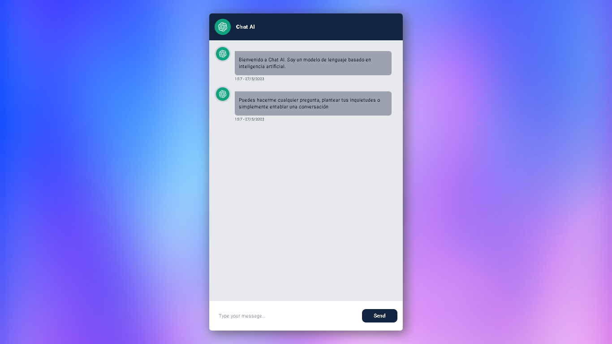

# Chat AI Clone


      
## Installation   

Install Chat AI with npm

- Clone of the repo in your local
- Run `npm run i` or `yarn run install`
- The project runs on port `3000`


```bash
  cd chatai-clone
  npm install / yarn run install
```
    
## Try Chat

- Get API KEY of OpenAI in [here](https://platform.openai.com/playground)
- After getting api key, add it in your .env file `OPENIA_APIKEY`

```bash
    OPENIA_APIKEY = XXXXXX
```

Now, you can play with the chat

## API

### POST - `/api/completion`
You can use this route as endpoint

#### Message Model:
    id: string,   
    content: string,   
    role: 'system' | 'user', 'assistant',  
    createdAt: Date | undefined   
    

#### 
    method POST,  
    headers: { "content-Type": "application/json" }, 
    body: Message[]
